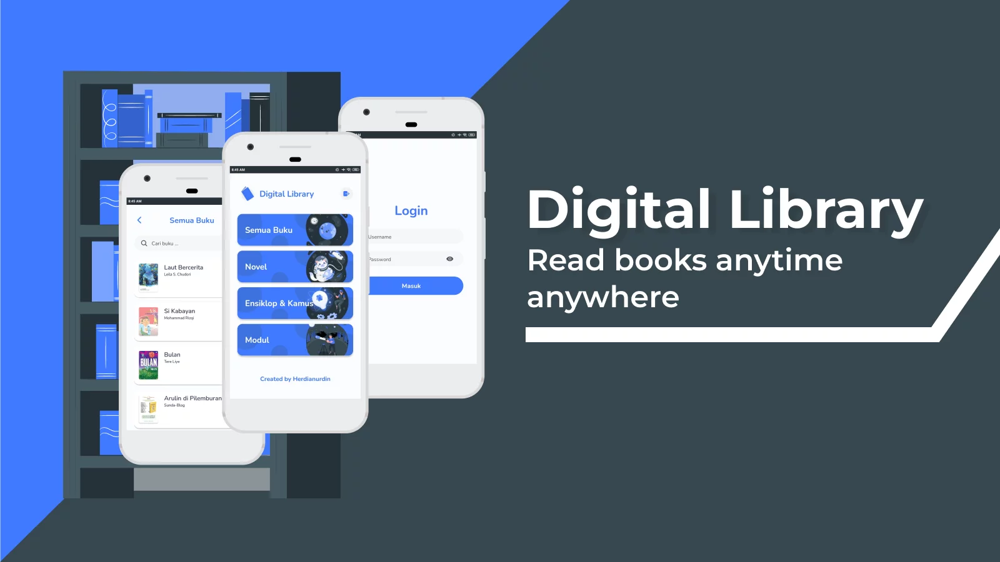

## About Project

This digital library was built to help school students who have limited access to the library. To access this application the user must be registered as a "Digital-Library" user, every time a user opens a book it will be immediately registered.

The illustration image is from the [storyset](https://storyset.com/).

### Built With

## License

Distributed under the MIT License. See [LICENSE](LICENSE) for more information.
